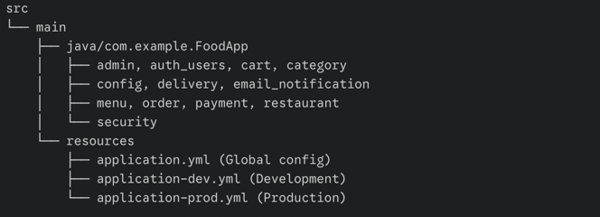

# 🍔 FoodApp Backend


FoodApp Backend is a robust **Spring Boot 3** REST API designed for a comprehensive food ordering system. It handles everything from user authentication to secure payment processing.

---

## 📌 Project Features
- 🔐 **Security:** User authentication and authorization via JWT.
- 👥 **Role Management:** Specific flows for Admin, Customer, and Delivery roles.
- 📋 **Management:** Full CRUD for Menu, Category, and Order management.
- 💳 **Payments:** Secure Stripe integration for checkout.
- 📧 **Notifications:** Automatic email notifications via SMTP.
- 🗄️ **Database:** Primary support for PostgreSQL with optional MySQL dev profile.
- ⚡ **Performance:** Redis integration for caching and asynchronous tasks.
- 📊 **Monitoring:** Real-time metrics and visualization using Prometheus & Grafana.

---

## 🛠 Technology Stack
* **Backend:** Java 17, Spring Boot 3, Spring Data JPA, Hibernate.
* **Database:** PostgreSQL, MySQL, Redis.
* **DevOps & CI/CD:** GitLab CI, Jenkins, Docker & Docker Compose.
* **Monitoring:** Prometheus, Grafana.
* **Testing:** JUnit 5, Mockito.
* **Deployment:** GitHub Actions, Render.

---

## ⚙️ Setup and Development

1. **Clone the repository**

```bash
git clone <backend-repo-url>
cd online-food-ordering-system
```

2. **Environment Variables (.env)**
   Create a .env.dev file in the root directory for development:

```env
DB_USERNAME=root
DB_PASSWORD=1234
DB_URL=jdbc:mysql://mysql:3306/fooddb
MAIL_USERNAME=your-email@gmail.com
MAIL_PASSWORD=your-password
JWT_SECRET=your_super_secret_jwt_key
STRIPE_PUBLIC_KEY=pk_test_xxx
STRIPE_SECRET_KEY=sk_test_xxx
SPRING_PROFILES_ACTIVE=dev
FRONTEND_BASE_URL=http://localhost:3000
BASE_PAYMENT_LINK=http://localhost:3000/pay?orderId=`
```
---

3. **Run with Docker Compose**
```bash 
   docker compose -f docker-compose.dev.yml up --build 
   ```
4. **Run Locally (Standard)**
   ```bash
   mvn clean install
   mvn spring-boot:run -Dspring-boot.run.profiles=dev
   ```
--- 

🚀 **Deployment**

* Render (Production)
* Connect your GitHub repository to Render.
* Build Command: 
```bash 
./mvnw clean package -DskipTests 
```
* Start Command: 
```bash 
java -jar target/online-food-ordering-system-0.0.1-SNAPSHOT.jar
```
* Add your .env.prod variables in the Render Dashboard under "Environment".

---

📊 Monitoring & Observability

Prometheus: Scrapes metrics from /actuator/prometheus endpoint.
Grafana: Visualizes application health, request latency, and JVM metrics via pre-configured dashboards.

---

📂 **Project Structure**



---

🔗 **Quick Links**

```markdown
🌐 [Live Demo](https://online-food-app-react.netlify.app/home)

💻 [Frontend Repo](https://github.com/mustafaguler3/online-food-ordering-frontend)
````